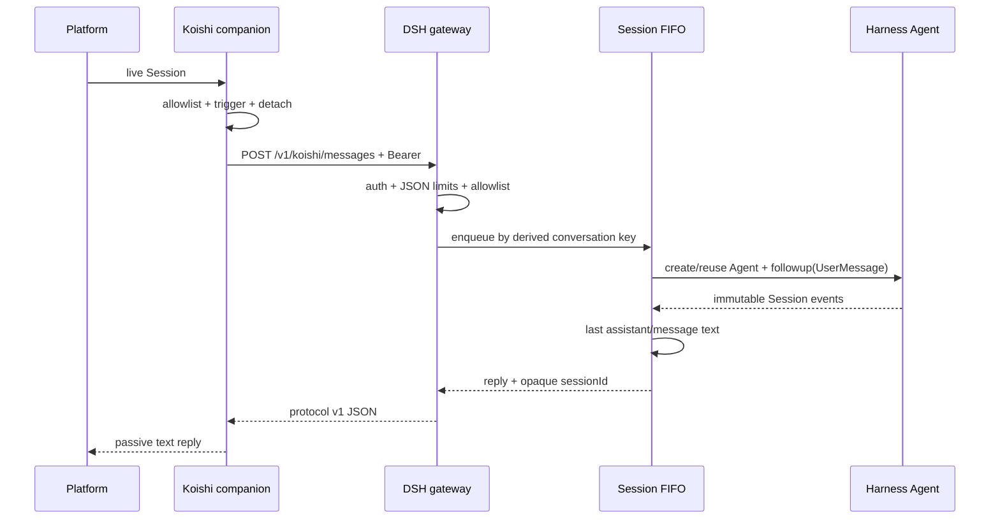

# dsh-plugin-koishi 实施规划

## 1. 项目目标

构建一个独立开源仓库，使已经运行的 DeepSeek Harness 能安全接收 Koishi 文本会话，并通过伴侣插件把最终文本回复送回原 Koishi 会话。

首版交付必须形成完整闭环：

1. Harness 侧插件拥有 HTTP Listener、认证、协议校验、Agent 与 Session 生命周期。
2. Koishi 侧插件拥有平台消息触发、允许频道、短生命周期 Session 处理和被动回复。
3. 同一会话严格串行，不同会话可以并行。
4. 默认配置拒绝所有频道，默认网络只允许本机回环。
5. 项目具备测试、构建、发布检查、CI、许可证和条目清晰的完整文档。

## 2. 与第一个项目的边界

| 项目                            | 进程与 Agent 所有者                        | 通信方式           | 推荐场景                                              |
| ------------------------------- | ------------------------------------------ | ------------------ | ----------------------------------------------------- |
| `koishi-plugin-adapter-harness` | Koishi 启动独立 Harness 子进程             | stdio JSON-RPC SDK | 单一 Koishi 应用、希望插件自带 Runtime                |
| `dsh-plugin-koishi`             | Harness 持有 Agent，Koishi 是远端/本地入口 | 带鉴权 HTTP        | 已有 Harness Runtime、需要独立部署或共享 Harness 组合 |

本项目不复制第一个项目的 Runtime Manager，也不在 Koishi 进程中启动 Harness 子进程。

## 3. 三个源项目提供的依据

### DeepSeek Harness

- 插件通过 Cordis Service 和 `ctx.effect()` 绑定生命周期。
- 程序化 Agent 入口是 `ctx.agents.create()`，输入通过 `agent.followup()`，整体静默点通过 `agent.whenIdle()` 观察。
- Session 事件日志是模型历史与输出事实来源；最终文本从当前活动区间最后一个 `assistant/message` 提取。
- Agent Handle 是释放能力，超时、回收、重置与插件卸载都必须调用它。
- 模型可见输入必须写入 Session 日志；本插件把最终格式化提示作为一个 `UserMessage` 发送。

### Koishi

- 普通消息接入使用 `ctx.middleware()`；跳过时必须调用 `next()`。
- 群聊点名使用 `session.stripped.appel`，文本使用 `session.stripped.content`。
- 插件配置使用 `Schema`，长生命周期 API 使用 `Service` 暴露到 Context。
- 被动回复可以作为中间件返回值交给 Koishi 发送。

### YesImBot

- live `Session` 只存在于消息入口，跨异步边界前提取稳定事实，不长期保存平台对象。
- 频道身份显式包含 `platform`、`selfId`、`channelId`、`userId` 和私聊类型。
- 允许频道采用严格默认拒绝，规则按 OR 匹配。
- 同一频道的工作采用 FIFO；日志不包含密钥或完整提示词。

精确提交和文件清单见 [SOURCES.md](./SOURCES.md)。

## 4. 首版架构

## 5. 关键决策

### 5.1 双包而不是单包双入口

- `dsh-plugin-koishi` 的 Peer API 属于 DeepSeek Harness。
- `koishi-plugin-dsh-bridge` 的 Peer API 属于 Koishi。
- 双包让两个宿主只加载自己的框架代码，同时保留一个仓库和一套协议。
- Koishi 源码只从 Harness 包的纯协议子路径导入共享类型与守卫，不会执行 DSH Service 入口；构建会把协议内联到伴侣产物，因此安装后的 Koishi 宿主不需要再安装 Harness 包。

### 5.2 HTTP 请求-响应而不是 WebSocket

- 首版只需要一条输入对应一个最终文本回复。
- HTTP 更容易部署、代理、鉴权、限制请求体和表达 401/403/429/504。
- 流式回复与主动推送推迟到协议版本明确需要时再设计。

### 5.3 会话身份

- 原始平台 ID 只进入进程内 `conversationKey`。
- Session ID 由 Runtime 随机前缀、SHA-256 会话摘要和池内单调代次组成。
- 空闲淘汰、故障重建和手动重置都会分配新代次，避免旧 Handle 尚未退出时发生 ID 冲突。
- 进程重启使用新 Runtime 前缀，因此首版不声明跨进程恢复。

### 5.4 并发与超时

- 每个会话有独立 Promise Tail，形成严格 FIFO。
- 不同会话不共享 Tail，可以并行。
- `maxPendingPerSession` 限制活动加排队回合。
- `maxSessions` 限制全局会话条目；达到上限时优先回收最久未使用的空闲会话。
- 超时先发送 `{ kind: 'hook' }` 取消，再淘汰 Handle；下一条消息创建新 Agent。

### 5.5 幂等与内存上限

- Koishi 在存在平台 `messageId` 时用平台、机器人、频道和消息 ID 的 SHA-256 生成 `requestId`。
- Gateway 在同一会话内缓存请求 Promise 与结果，重复请求复用原执行。
- `dedupeTtlMs` 控制时间窗口，`maxDedupeEntriesPerSession` 控制条目数。
- 缓存满时只淘汰已完成的最旧记录，不会为仍在执行的请求解除幂等保护。

### 5.6 默认安全策略

- 两端 `allowedChannels: []` 都表示拒绝全部。
- Harness 默认监听 `127.0.0.1`。
- Token 至少 32 个字符，推荐 256 bit 随机值。
- 健康检查也要求 Token。
- Koishi 对非回环 HTTP 默认报错，远程明文必须显式确认。
- HTTP 错误不返回内部堆栈；日志不写请求正文或原始会话 ID。

## 6. 首版非目标

- 图片、音频、文件和引用消息转换。
- reasoning、工具调用卡片和流式 chunk 转发。
- 主动消息或 Harness 主动唤醒 Koishi。
- 跨进程 Session 恢复与持久 requestId 去重。
- 多租户 Token、OAuth、mTLS 或权限委托。
- 自动配置 Harness 工具、安全沙箱或模型 Provider。
- npm Registry 发布；GitHub 开源仓库与可发布产物验证是本次范围。

## 7. 验证计划

- 协议：合法请求、未知字段、控制字符、输入上限、响应类型守卫。
- 路由：默认拒绝、通配规则、三种 Session Scope、群聊发送者清理。
- 会话池：同会话串行、跨会话并行、重复请求、队列上限、超时、重置、最终文本。
- HTTP：401、405、413、415、429、健康检查、消息与重置。
- 双包端到端：真实本地 HTTP Listener + 真实 Koishi Fetch Client。
- 静态检查：TypeScript strict、oxlint、Prettier。
- 发布检查：pkgroll、ESM/CJS 实际导入、publint、npm pack 文件白名单。
- 安全检查：`npm audit --omit=dev`、敏感信息扫描、Git diff 检查。

## 8. 里程碑

- [x] M0：盘点三个源项目与已有第一个项目。
- [x] M1：确定 Harness 网关 + Koishi 伴侣双包架构。
- [x] M2：完成协议、配置、路由、HTTP、Session Pool 和 Service。
- [x] M3：完成单元测试与无密钥端到端测试。
- [x] M4：完成构建、发布结构和导入验证。
- [x] M5：完成 README、架构、配置、部署、开发与排障文档。
- [x] M6：创建公开 GitHub 仓库、推送初始版本并验证远端 CI。
- [ ] M7：后续评估流式协议、媒体输入、持久恢复和主动消息。

## 9. 验收标准

1. 新项目位于独立 `dsh-plugin-koishi/` 文件夹。
2. 三个源项目不被修改，用户现有工作树不被覆盖。
3. 两个包在锁定依赖下通过类型、lint、测试、构建与发布检查。
4. 文档能够让新使用者理解安全边界、完成本机部署并定位常见错误。
5. GitHub 仓库为 Public，默认分支包含 MIT License、CI 和完整源码。
