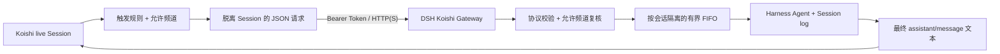

# dsh-plugin-koishi

[](https://github.com/nazidada/dsh-plugin-koishi/actions/workflows/ci.yml)
[](./LICENSE)
[](https://nodejs.org/)

`dsh-plugin-koishi` 是一个双端桥接项目：DeepSeek Harness 侧运行带鉴权的消息网关，Koishi 侧通过伴侣插件把经过允许和触发判断的文本会话转发给 Harness Agent，再把最终文本回复送回原会话。

这是本系列的第二个项目。第一个项目 [`koishi-plugin-adapter-harness`](https://github.com/nazidada/koishi-plugin-adapter-harness) 由 Koishi 启动和管理独立 Harness 子进程；本项目反转所有权，由已经运行的 Harness 持有 Agent 和 Session，Koishi 只作为消息入口。两者适合不同部署方式，并不互相替代。

> [!IMPORTANT]
> 当前仓库完成的是 GitHub 源码开源与可发布 npm 包产物验证，不代表两个包已经发布到 npm Registry。首次使用请按“从源码安装”构建并安装本地包目录。

## 项目组成

| 包                         | 运行位置         | 主要职责                                                                                             |
| -------------------------- | ---------------- | ---------------------------------------------------------------------------------------------------- |
| `dsh-plugin-koishi`        | DeepSeek Harness | Bearer Token 鉴权、严格协议校验、允许频道复核、Agent 创建、每会话 FIFO、超时取消、请求去重、会话回收 |
| `koishi-plugin-dsh-bridge` | Koishi           | 允许频道与触发判断、脱离 live `Session`、HTTP 转发、错误反馈、`dsh.reset` 命令                       |

## 核心特性

- 双重默认拒绝：Harness 与 Koishi 两端的 `allowedChannels` 默认都是空数组，未显式配置时不接收任何会话。
- 安全连接基线：Harness 默认只监听 `127.0.0.1`；共享 Token 至少 32 个字符；Koishi 默认拒绝向非本机地址发送明文 HTTP。
- 严格协议：请求版本、字段集合、标识符、输入长度、Content-Type 和请求体大小都在 HTTP 边界验证。
- 会话隔离：支持 `channel`、`user`、`channel-user` 三种范围；平台原始 ID 只参与 SHA-256 派生，不出现在 Harness Session ID 中。
- 明确并发：同一会话严格串行，不同会话可以并行；每会话排队数和全局会话数都有上限。
- 幂等重试：同一会话中的相同 `requestId` 在 TTL 内复用同一结果，不会重复启动模型回合。
- 可控故障：超时会取消并淘汰当前 Agent，下一条消息使用新 Session 代次；重置、空闲回收和关闭都释放持有的 Agent Handle。
- 日志最小化：不记录 Token、完整用户消息、原始频道 ID 或用户 ID；诊断只包含平台名、错误类型和不可逆短指纹。
- 双格式 Koishi 产物：伴侣包同时提供 ESM、CommonJS 和对应类型声明；Harness 包保持 ESM。
- 独立安装：共享协议会内联到 Koishi 伴侣产物，Koishi 宿主不需要安装 Harness 端包。

## 架构概览



详细的数据流、生命周期和错误语义见 [架构说明](./docs/architecture.md)。

## 环境要求

- Node.js `^22.19.0` 或 `>=24.0.0`
- DeepSeek Harness 包 `0.1.0-rc.6`
- `@deepseek-ai/cordis` `4.0.1`
- Koishi `^4.18.11`
- 一个由 Harness 已加载的模型 Provider；示例使用 DeepSeek Provider
- 同一个随机共享 Token；推荐 64 个十六进制字符

Harness 仍处于 RC 阶段，本项目把相关开发与 Peer 兼容范围精确固定到 `0.1.0-rc.6`。升级 Harness 时必须重新执行完整检查。

## 快速开始

### 1. 克隆并构建

```bash
git clone https://github.com/nazidada/dsh-plugin-koishi.git
cd dsh-plugin-koishi
npm ci --ignore-scripts
npm run check
```

`npm run check` 会依次执行 lint、格式检查、严格类型检查、测试、构建、`publint` 和干跑打包清单检查，不会调用真实模型。

### 2. 生成共享 Token

```bash
openssl rand -hex 32
```

把结果分别注入 Harness 进程和 Koishi 进程：

```bash
export DSH_KOISHI_TOKEN="刚生成的 64 位十六进制字符串"
```

不要把真实 Token 写进 `cordis.yml`、`koishi.yml`、Issue、日志或 Git 历史。

### 3. 安装 Harness 端包

在承载 Harness Runtime 的项目中安装构建后的本地包：

```bash
npm install /absolute/path/to/dsh-plugin-koishi/packages/dsh-plugin-koishi
```

把下面的网关条目加入现有 Harness 组合；Provider 与 Agent Spine 仍由现有 Runtime 负责：

```yaml
- id: koishi-gateway
  name: dsh-plugin-koishi
  config:
    host: 127.0.0.1
    port: 8787
    provider: deepseek-official
    model: deepseek-v4-flash
    sessionScope: channel
    allowedChannels:
      - platform: onebot
        channelId: "123456"
        isDirect: false
```

完整的无工具聊天组合见 [`examples/dsh/cordis.yml`](./examples/dsh/cordis.yml)，程序化启动方式见 [`examples/dsh/runtime.mjs`](./examples/dsh/runtime.mjs)。

> [!WARNING]
> 网关创建的 Agent 继承当前 Harness 组合中的全部工具与权限。如果 Runtime 已加载 Bash、文件写入、子代理或无人值守工具，来自聊天平台的消息也可能驱动这些能力。普通聊天部署建议使用示例中的无工具 Agent Spine，或单独审计 sandbox、approval、工作目录和 Provider。

### 4. 安装 Koishi 端包

在 Koishi 应用目录安装构建后的伴侣包：

```bash
npm install /absolute/path/to/dsh-plugin-koishi/packages/koishi-plugin-dsh-bridge
```

在 `koishi.yml` 中启用短名 `dsh-bridge`：

```yaml
plugins:
  dsh-bridge:
    baseURL: http://127.0.0.1:8787
    trigger: direct-and-mention
    allowedChannels:
      - platform: onebot
        channelId: "123456"
        isDirect: false
```

两端 `allowedChannels` 应保持一致。默认 `eagerCheck: true`，因此建议先启动 Harness，再启动 Koishi。完整示例见 [`examples/koishi/koishi.yml`](./examples/koishi/koishi.yml)。

### 5. 验证网关

健康接口也要求 Token，用于同时验证连通性和凭据：

```bash
curl --fail-with-body \
  -H "Authorization: Bearer ${DSH_KOISHI_TOKEN}" \
  http://127.0.0.1:8787/healthz
```

预期返回：

```json
{
  "ok": true,
  "version": 1,
  "service": "dsh-plugin-koishi",
  "sessions": 0,
  "activeSessions": 0,
  "pendingTurns": 0
}
```

## 默认行为

- 私聊消息会触发转发；群聊仅在机器人被 `@` 或昵称点名时转发。
- 群聊提示会附带经过控制字符清理的发送者显示名。
- 相同会话内的模型回合严格按到达顺序执行。
- 不同会话可以并行，直到 Harness 自身资源或 `maxSessions` 上限。
- 只发送最后一个 `assistant/message` 的文本块，不转发 reasoning、工具状态、图片或流式 chunk。
- `dsh.reset` 会为当前会话切换到一个新的不透明 Harness Session ID。
- 空闲会话在 `idleTtlMs` 后于下一次请求到来时回收。
- Harness 或插件重启后使用新的 Runtime 随机前缀；本版本不自动恢复旧 Session。

## 允许频道

规则按 OR 合并。`platform` 和 `channelId` 支持精确值或 `*`，`isDirect` 省略时同时匹配私聊与群聊：

```yaml
allowedChannels:
  - platform: onebot
    channelId: "group-123"
    isDirect: false
  - platform: discord
    channelId: "dm-456"
    isDirect: true
```

明确允许所有路由必须显式写出：

```yaml
allowedChannels:
  - platform: "*"
    channelId: "*"
```

详细配置字段见 [配置参考](./docs/configuration.md)。

## 远程部署

同机回环连接是推荐模式。跨主机部署时至少满足以下之一：

1. 使用 HTTPS 反向代理，并让 Harness 网关只监听代理可达的私有地址。
2. 使用 WireGuard、Tailscale、SSH Tunnel 等可信隧道，再显式设置 `allowInsecureRemote: true`。
3. 使用主机防火墙只允许 Koishi 来源地址，并定期轮换 Token。

不要直接把 `0.0.0.0:8787` 暴露到公网。完整清单见 [部署指南](./docs/deployment.md) 和 [安全策略](./SECURITY.md)。

## 文档索引

- [实施规划](./PLAN.md)：目标、范围、里程碑和验收标准。
- [架构说明](./docs/architecture.md)：数据流、信任边界、FIFO、去重、超时和生命周期。
- [配置参考](./docs/configuration.md)：Harness 与 Koishi 两端全部配置字段。
- [部署指南](./docs/deployment.md)：本机、跨主机、启动顺序、健康检查和安全清单。
- [开发指南](./docs/development.md)：目录、命令、测试、构建和发布流程。
- [故障排查](./docs/troubleshooting.md)：401、403、429、504、空回复和连接问题。
- [来源说明](./SOURCES.md)：三个参考项目的提交、文件和设计映射。
- [贡献指南](./CONTRIBUTING.md) 与 [安全策略](./SECURITY.md)。

## 当前限制

- 仅支持文本输入和最终文本输出。
- HTTP 请求在整轮完成后返回；暂不支持流式输出或中间工具状态。
- 请求幂等缓存仅在当前进程内有效。
- Gateway 不恢复旧的持久 Session；Harness 持久化后端可能保存日志，但本插件每次进程启动使用新的 Session 前缀。
- HTTP Bridge 不传递 Koishi `Session`、Bot 对象、引用消息、图片或其他资源元素。
- Harness RC API 继续变化时可能需要同步升级。

## 开源与许可证

项目使用 [MIT License](./LICENSE)。三个参考项目均采用 MIT License；本项目基于公开接口与架构原则独立实现，没有复制其大段源码。具体来源版本与参考文件记录在 [SOURCES.md](./SOURCES.md)。
