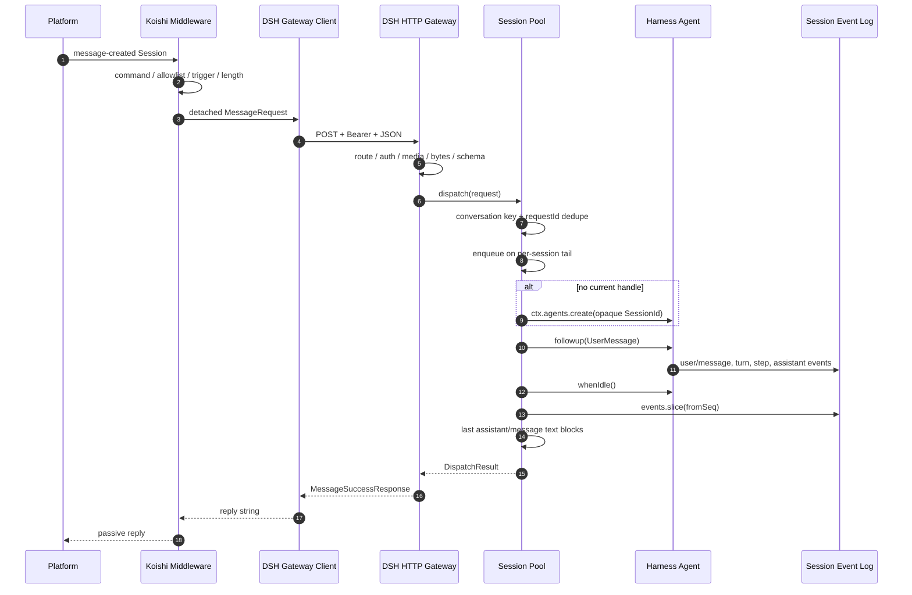

# 架构说明

## 1. 设计目标

`dsh-plugin-koishi` 解决的是“由现有 DeepSeek Harness Runtime 接管 Koishi 会话”的问题。它不创建第二套 Agent Runtime，也不把 Koishi live `Session` 对象带入 Harness。

设计优先级依次是：

1. 明确宿主与资源所有权。
2. 默认拒绝与最小网络暴露。
3. 同一会话顺序一致、不同会话可并行。
4. 失败后能够收敛并释放 Agent Handle。
5. 协议和日志中减少不必要的身份暴露。
6. 保持首版协议足够小，未来可版本化演进。

## 2. 组件

### 2.1 Koishi 伴侣端

`koishi-plugin-dsh-bridge` 运行在 Koishi Context 中，提供 `ctx.dshBridge` Service。它负责：

- 注册消息中间件和 `dsh.reset` 命令。
- 读取 `session.stripped.content`、`session.stripped.appel` 与稳定平台字段。
- 执行本地 `allowedChannels` 和触发策略。
- 在进入 HTTP Client 前构造纯 JSON 请求，之后不保留 live `Session`。
- 把网关最终文本作为中间件返回值交给 Koishi。
- 将 429、504 和其他错误映射为可配置的用户提示。

### 2.2 Harness 网关端

`dsh-plugin-koishi` 是 `@deepseek-ai/cordis` Service，静态注入 `ctx.agents`。它负责：

- 绑定和关闭 Node HTTP Server。
- 对所有已知路由校验 Bearer Token。
- 限制 Method、Content-Type、Header 数量、请求体字节和输入字符。
- 把 HTTP JSON 解析成不可变协议对象。
- 再次执行 `allowedChannels`。
- 把请求送入 Session Pool。

### 2.3 Session Pool

Session Pool 只保存脱离平台的会话键、队列状态、请求去重记录与 Harness `AgentHandle`。每个条目拥有：

- `key`：由 Session Scope 决定的进程内稳定会话键。
- `generation`：池内全局单调分配的 Session 代次。
- `handle`：当前 Harness Agent 的所有权能力。
- `tail`：该会话 FIFO 的 Promise Tail。
- `pending`：活动加排队任务数。
- 两个去重 Map：消息与重置请求分开记录。
- `lastUsed`：空闲回收依据。

## 3. 数据流



## 4. 信任边界

### 4.1 平台到 Koishi

平台消息、显示名、消息 ID 与频道字段都不可信。Koishi 伴侣端：

- 不执行消息内容。
- 不把字段拼接到 Shell、路径或 URL。
- 只在群聊提示标签中使用经过控制字符与空白压缩的显示名。
- 对平台消息 ID 做 SHA-256 后再作为 `requestId`。

### 4.2 Koishi 到 Harness HTTP

即使 Koishi 端已经检查，HTTP 仍是独立不可信边界。Harness 端不信任客户端已完成的验证：

- 所有已知端点都要求 Token，包括 `/healthz`。
- 只接受协议定义的字段；未知字段拒绝。
- 原始 ID 必须非空、无首尾空白、无 Unicode `Cc` 控制字符并满足长度上限。
- 请求体在缓冲前受字节限制。
- `allowedChannels` 再检查一次。
- Koishi Client 禁止 HTTP 重定向，并以流式读取方式把响应硬限制为 64 KiB，避免先无界缓冲再校验。

### 4.3 Harness Agent 与工具

网关只负责 Agent 输入和生命周期，不限制宿主加载的工具。模型调用之后的 Bash、文件、网络、MCP、子代理和审批能力属于 Harness 组合的权限面。部署者必须将聊天入口视为不可信远程输入。

## 5. 会话身份

### 5.1 Conversation Key

键使用 JSON 数组编码，避免简单分隔符碰撞。

| Scope          | 群聊键                                   | 私聊键                                   |
| -------------- | ---------------------------------------- | ---------------------------------------- |
| `channel`      | `platform + selfId + channelId`          | `platform + selfId + channelId + userId` |
| `user`         | `platform + selfId + userId`             | 同左                                     |
| `channel-user` | `platform + selfId + channelId + userId` | 同左，但包含 direct 标签                 |

私聊的 `channel` Scope 额外包含 `userId`，避免某些适配器复用私聊频道标识时发生上下文串联。

### 5.2 Harness Session ID

形式为：

```text
koishi-<runtime-random>-<sha256(conversation-key)[0:32]>-<generation>
```

性质：

- 不含原始平台、频道或用户 ID。
- 同一进程、同一活动条目内稳定。
- 重置、超时失效和重新创建条目时分配新代次。
- Runtime 重启时随机前缀变化，因此不会与旧进程 Session ID 冲突。

首版不会调用 `ctx.agents.resume()`。即使宿主配置了 Session Persistence，网关也只创建新 Session；持久后端可能保存日志，但插件不会自动恢复。

## 6. 并发模型

### 6.1 同一会话

每个 Session Entry 有一个 `tail: Promise<void>`：

1. 新任务以 `entry.tail.then(task)` 接在尾部。
2. 新 Tail 吞掉前一个任务的成功或失败，只用于排序。
3. 调用者仍持有原任务 Promise，能收到真实结果或错误。
4. `pending` 在入队前增加，在任务完成或失败后减少。

因此前一个回合失败不会堵死后续回合，后一个回合也不会越过前一个回合。

### 6.2 不同会话

不同 Entry 没有共享 Tail，可以同时调用不同 Agent。最终并行度仍受模型 Provider、Harness Runtime 和主机资源限制。

### 6.3 容量

- `maxPendingPerSession`：单会话活动加排队任务上限，超过返回 429。
- `maxSessions`：Entry 总数上限。
- 达到全局上限时，优先移除 `pending === 0` 且 `lastUsed` 最早的 Entry。
- 没有可回收空闲 Entry 时返回 429，不强制中断活动会话。

## 7. 幂等模型

Koishi 端有平台 `messageId` 时，`requestId` 是以下字段的 SHA-256：

- `platform`
- `selfId`
- `channelId`
- `messageId`

Gateway 的去重作用域是 Conversation Key，因此不同会话使用相同平台消息 ID 不会相互覆盖。

去重记录从请求入队时开始保存 Promise：

- 重复请求在原任务执行中到达，会等待同一 Promise。
- 原任务已完成时到达，会复用结果或原错误。
- TTL 从原任务完成后开始计算；活动请求不会因 TTL 到期而被删除。
- 达到条目上限时，只删除已完成的最旧记录。
- 进程重启后缓存丢失，因此协议没有声明跨进程 Exactly Once。

## 8. 超时和错误收敛

### 8.1 Turn 超时

1. `turnTimeoutMs` 到达。
2. 调用 `agent.cancel({ kind: 'hook', reason: 'koishi gateway turn timeout' })`。
3. 当前 Handle 从 Entry 移除并分配新代次。
4. `handle.dispose()` 在受跟踪的退休任务中执行。
5. HTTP 返回 504 `turn_timeout`。
6. 下一条消息创建新 Agent，不复用状态不确定的旧 Agent。

### 8.2 Agent 或 Provider 失败

如果 `followup()` 或 `whenIdle()` 抛错，采用与超时相同的 Handle 失效路径，HTTP 返回通用 500。Provider 原始错误不会返回给 Koishi，也不会原样进入 Gateway 日志。

### 8.3 手动重置

`dsh.reset` 使用独立 Reset Request：

1. 进入同一会话 FIFO，等待此前消息结束。
2. 清除当前 Handle。
3. 分配新代次。
4. 取消并等待旧 Handle Dispose。
5. 后续消息使用新 Session ID。

### 8.4 关闭

Harness 插件卸载：

1. 关闭 HTTP Listener 和连接，停止新请求。
2. Session Pool 标记 Closed。
3. 向活动 Agent 发送 `disposed` 取消。
4. 排队但未开始的任务看到 Closed 后拒绝。
5. 等待 Tail 收敛并 Dispose 所有 Handle。

## 9. HTTP 协议

协议版本固定为 `1`。

### 9.1 端点

| Method | 默认路径                    | 用途                     |
| ------ | --------------------------- | ------------------------ |
| `GET`  | `/healthz`                  | 鉴权、版本和聚合队列状态 |
| `POST` | `/v1/koishi/messages`       | 提交一条文本消息         |
| `POST` | `/v1/koishi/sessions/reset` | 重置一个会话             |

### 9.2 Message Request

```json
{
  "version": 1,
  "requestId": "koishi-<sha256>",
  "conversation": {
    "platform": "onebot",
    "selfId": "bot-1",
    "channelId": "group-1",
    "userId": "user-1",
    "isDirect": false
  },
  "message": {
    "text": "你好",
    "authorName": "Alice"
  },
  "sentAt": 1786680000000
}
```

### 9.3 Success Response

```json
{
  "ok": true,
  "version": 1,
  "requestId": "koishi-<sha256>",
  "sessionId": "koishi-<opaque>",
  "reply": "你好！"
}
```

### 9.4 错误映射

| HTTP | Code                     | 含义                   | Koishi 默认反馈 |
| ---: | ------------------------ | ---------------------- | --------------- |
|  400 | `bad_request`            | JSON 或字段不合法      | 通用错误        |
|  401 | `unauthorized`           | Token 缺失或错误       | 通用错误        |
|  403 | `channel_denied`         | Harness 端允许列表拒绝 | 通用错误        |
|  404 | `not_found`              | 路径错误               | 通用错误        |
|  405 | `method_not_allowed`     | Method 错误            | 通用错误        |
|  413 | `body_too_large`         | 请求体超过字节上限     | 通用错误        |
|  415 | `unsupported_media_type` | 非 JSON                | 通用错误        |
|  429 | `gateway_busy`           | 队列或容量已满         | `busyReply`     |
|  503 | `gateway_closed`         | 正在关闭               | 通用错误        |
|  504 | `turn_timeout`           | Harness 回合超时       | `timeoutReply`  |
|  500 | `internal_error`         | 内部或 Provider 失败   | `errorReply`    |

## 10. 输出选择

一个 Harness 回合可能包含多次 `assistant/message`（例如工具调用前后的多个 Step）。Pool 只读取本次提交前 `session.seq` 之后的事件，并倒序选择最后一个 `assistant/message`，拼接其中全部 `type: 'text'` Block。

以下内容首版不会发送给 Koishi：

- `assistant/chunk`
- reasoning Block
- 工具调用与结果
- Token Usage
- 非文本 Content Block

如果最终消息没有文本，Koishi 使用 `emptyReply`。
