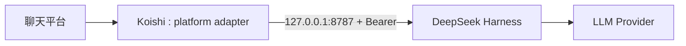

# 部署指南

## 1. 推荐拓扑：同机回环



优点：

- Gateway 不暴露到局域网或公网。
- 不需要额外 TLS 终止。
- Token 仍然保护本机其他进程发起的请求。
- 故障定位简单。

## 2. 从源码安装

### 2.1 构建仓库

```bash
git clone https://github.com/nazidada/dsh-plugin-koishi.git
cd dsh-plugin-koishi
npm ci --ignore-scripts
npm run check
```

构建产物：

```text
packages/dsh-plugin-koishi/dist/
packages/koishi-plugin-dsh-bridge/dist/
```

### 2.2 安装到两个宿主

Harness 应用：

```bash
npm install /absolute/path/to/dsh-plugin-koishi/packages/dsh-plugin-koishi
```

Koishi 应用：

```bash
npm install /absolute/path/to/dsh-plugin-koishi/packages/koishi-plugin-dsh-bridge
```

使用 pnpm 或 Yarn 的宿主可以使用各自的本地目录安装语法；不要把仓库根目录当成运行时包安装，根目录是 Private Workspace。

## 3. Secret 准备

生成 256 bit Token：

```bash
openssl rand -hex 32
```

两个进程都设置：

```bash
export DSH_KOISHI_TOKEN="<64-hex-token>"
```

Harness Provider 另行设置模型 Key，例如：

```bash
export DEEPSEEK_API_KEY="<provider-key>"
```

共享 Gateway Token 与 Provider API Key 用途不同，不能复用。

## 4. 启动顺序

1. 启动 Harness Runtime。
2. 用鉴权 Health 检查 Gateway。
3. 启动 Koishi。
4. 检查 Koishi `eagerCheck` 成功。
5. 在允许的私聊或群聊中做最小消息测试。
6. 执行一次 `dsh.reset` 验证重置路径。

健康检查：

```bash
curl --fail-with-body \
  --connect-timeout 3 \
  --max-time 5 \
  -H "Authorization: Bearer ${DSH_KOISHI_TOKEN}" \
  http://127.0.0.1:8787/healthz
```

Health 只证明 Listener、Token 与协议可用，不会发起模型调用。首次部署仍应做一条真实消息验收。

## 5. Harness 组合

网关要求宿主已经提供：

- `ctx.agents` Registry。
- Agent Factory（通常由 `@deepseek-ai/dsh-agent-loop` 或 Agent Spine 提供）。
- 一个匹配 `provider` / `model` 的 LLM Adapter。

仓库提供两种示例：

- [`examples/dsh/cordis.yml`](../examples/dsh/cordis.yml)：Loader 配置片段。
- [`examples/dsh/runtime.mjs`](../examples/dsh/runtime.mjs)：程序化 Runtime。

示例禁用 Bash、Skill、Job、Goal 与 Workspace Context。把网关加入现有 Coding Agent 前必须理解：平台消息会进入那个 Agent 的全部工具面。

## 6. Koishi 配置

短名 `dsh-bridge` 对应包 `koishi-plugin-dsh-bridge`。配置见 [`examples/koishi/koishi.yml`](../examples/koishi/koishi.yml)。

如果使用 Koishi Console：

1. 安装伴侣包。
2. 在插件市场/本地插件列表启用 `dsh-bridge`。
3. 设置 Base URL、允许频道和触发模式。
4. Token 留空时插件从 `tokenEnv` 指定的进程环境读取。
5. 保存后让 Service 重启并完成 Health Check。

## 7. 跨主机部署

### 7.1 HTTPS 反向代理

推荐让 Gateway 监听 Harness 主机回环，由 Caddy、Nginx 或 Cloudflare Tunnel 等终止 TLS。反向代理必须：

- 保留 `Authorization` Header。
- 限制请求体大小不高于 Gateway 配置。
- 设置合理的上游读超时，高于 `turnTimeoutMs`。
- 禁止把 Authorization Header 写入访问日志。
- 只暴露三个所需路径。

Koishi 配置使用 `https://` Origin，无需 `allowInsecureRemote`。

### 7.2 VPN 或 SSH Tunnel

示例 SSH 本地转发：

```bash
ssh -N -L 8787:127.0.0.1:8787 user@harness-host
```

Koishi 仍连接 `http://127.0.0.1:8787`，不需要启用远程明文例外。

如果直接使用 WireGuard/Tailscale 私网地址上的 HTTP，必须显式 `allowInsecureRemote: true`，并用防火墙限制源地址。这个开关只是部署者确认，不会加密流量。

## 8. 防火墙与绑定

- `127.0.0.1`：只接受 IPv4 本机。
- `::1`：只接受 IPv6 本机。
- 私网地址：只绑定需要的接口，不使用 `0.0.0.0`。
- 必须绑定 `0.0.0.0` 时，用主机防火墙按来源 IP 和端口限制；仍不建议公网直连。

## 9. 进程管理

使用 systemd、Docker Compose、PM2 或其他监督器时：

- Harness 的 Ready Check 使用带 Token 的 `/healthz`。
- Koishi 依赖 Harness Ready 后启动，或暂时设置 `eagerCheck: false` 并由监督器重试。
- 优雅停止应先停 Koishi，再停 Harness，减少正在处理的入站请求。
- 给 Harness 足够的终止宽限，让活动 Agent Cancel 和 Handle Dispose 收敛。
- 不要在命令行参数中传 Token，以免进入进程列表；使用环境文件或 Secret Mount。

## 10. 升级与回滚

升级前：

1. 阅读 `CHANGELOG.md`。
2. 确认协议版本没有变化。
3. 在临时目录执行 `npm ci --ignore-scripts && npm run check`。
4. 先升级 Harness 端，Health 通过后再升级 Koishi 端。
5. 做真实消息与 Reset 验收。

回滚时两个包应回到同一仓库版本。协议不兼容时 Client 会拒绝响应并给出通用错误，不会猜测字段。

## 11. 上线检查清单

- [ ] Token 来自随机生成，长度至少 32 字符。
- [ ] Token 未进入 Git、日志或 Shell History。
- [ ] 两端允许列表都不是意外的 `*/*`。
- [ ] Listener 未直接暴露公网。
- [ ] 远程链路使用 HTTPS 或可信隧道。
- [ ] Harness Runtime 的工具权限已审计。
- [ ] `workspacePath` 不包含不必要的敏感文件。
- [ ] Koishi Timeout 高于 Harness Turn Timeout。
- [ ] Health、私聊/群聊触发和 Reset 均已验收。
- [ ] 监控 401、403、429、504 与进程重启频率。
